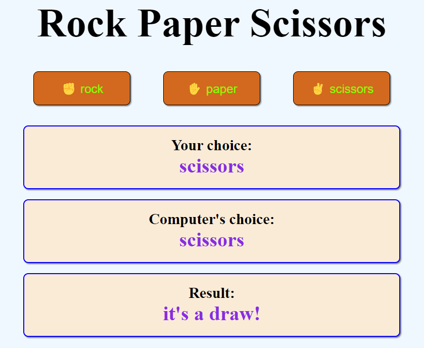

# Rock-Paper-Scissors

This is a very simple rock paper scissors written in Java Script. 
I've added some basic CSS styling to make it look nicer.

## Screenshot

### Links

- Tutorial: (https://www.freecodecamp.org/news/learn-javascript-by-coding-7-games/)
- Live Site URL: (https://rocky-mpn.github.io/Rock-Paper-Scissors/)

### Built with

- HTML5
- CSS
- Java Script