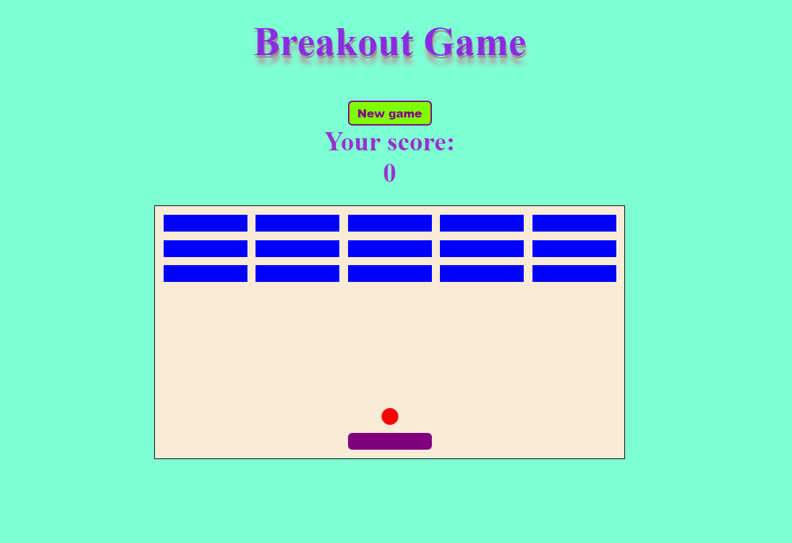

# A simple JavaScript Breakout game

This is my variation of a breakout game. I created it while learning JavaScript concepts.

# Screenshot

# Links

- Solution URL: https://github.com/Rocky-MPN/Frontend/tree/main/FreeCodeCamp/Breakout-Game
- Live Site URL: https://rocky-mpn.github.io/Breakout-Game/

# Built with

- HTML
- CSS
- Javascript

# Useful sources

- I've followed the amazing tutorial prepared by [Ania Kubów](https://twitter.com/ania_kubow) which helped me to get my head around the idea of memory game JS functionality. I highly recommend it to all beginners.
You can find it here: [Learn JavaScript by Building 7 Games](https://www.youtube.com/watch?v=ec8vSKJuZTk&ab_channel=freeCodeCamp.org)

#  Author

- [@rocky_mpn](https://www.twitter.com/rocky_mpn)

