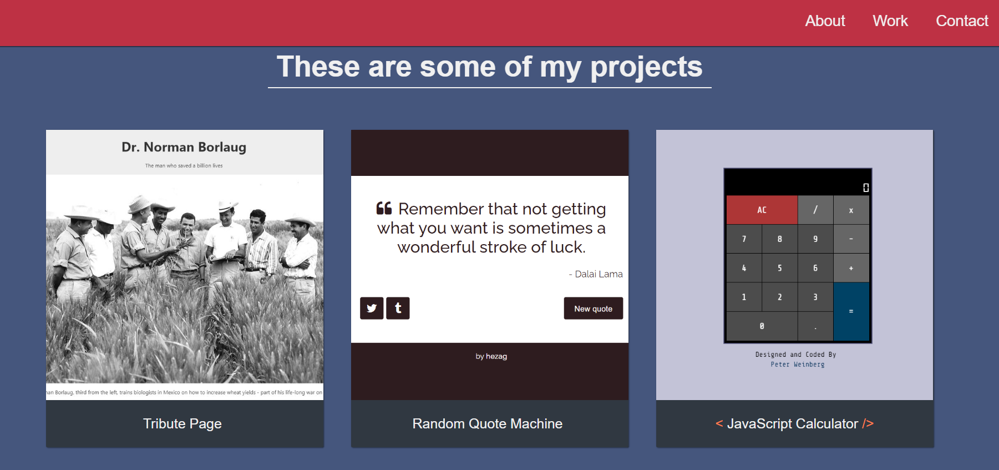

# Personal Portfolio project

I built this as part of FreeCodeCamp Responsive Website course

# Screenshot

# Links

- Solution URL: [github.com/Rocky-MPN/Frontend/tree/main/FCC-Memory-Game](https://github.com/Rocky-MPN/Frontend/tree/main/FreeCodeCamp/Personal-Portfolio)
- Live Site URL: [rocky-mpn.github.io/Personal-Portfolio/](https://rocky-mpn.github.io/Personal-Portfolio/)

# Built with

- HTML
- CSS

#  Author

- [@rocky_mpn](https://www.twitter.com/rocky_mpn)

