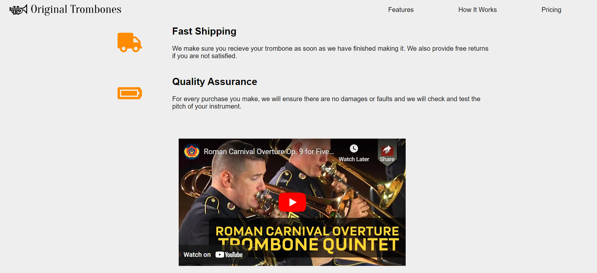

# Product Landing Page

I built this as part of FreeCodeCamp Responsive Website course.

# Screenshot

# Links

- Solution URL: [github.com/Rocky-MPN/Frontend/tree/main/Product-Landing-Page](https://github.com/Rocky-MPN/Frontend/tree/main/FreeCodeCamp/Product-Landing-Page)
- Live Site URL: [rocky-mpn.github.io/Product-Landing-Page/](https://rocky-mpn.github.io/Product-Landing-Page/)

# Built with

- HTML
- CSS

#  Author

- [@rocky_mpn](https://www.twitter.com/rocky_mpn)

