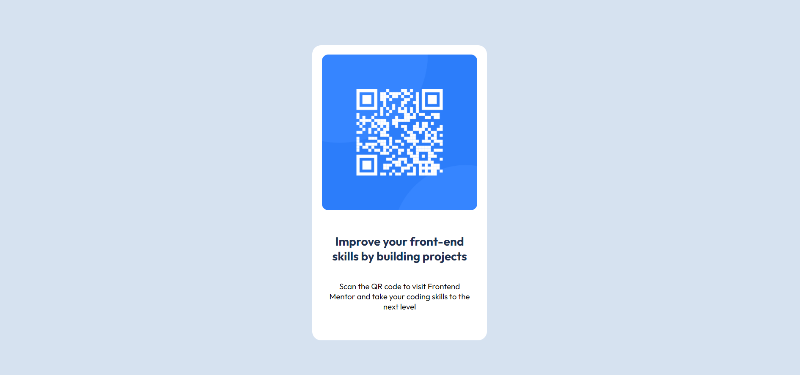

# Frontend Mentor - QR code component solution

This is a solution to the [QR code component challenge on Frontend Mentor](https://www.frontendmentor.io/challenges/qr-code-component-iux_sIO_H). Frontend Mentor challenges help you improve your coding skills by building realistic projects. 

## Table of contents

- [Overview](#overview)
  - [Screenshot](#screenshot)
  - [Links](#links)
- [My process](#my-process)
  - [Built with](#built-with)
  - [What I learned](#what-i-learned)

**Note: Delete this note and update the table of contents based on what sections you keep.**

## Overview
As part of practising my HTML and CSS skills I took part in several challanges from Frontend Mentor.

This challenge was to build out QR code component and get it looking as close to the design as possible.

### Screenshot

### Links

- Solution URL: https://github.com/Rocky-MPN/QR-Code-Component/blob/e74cbcb7d067a03abf06f667094e903f7adf60a1/index.html
- Live Site URL: https://rocky-mpn.github.io/QR-Code-Component/

## My process

### Built with

- Semantic HTML5 markup
- CSS custom properties
- Flexbox

### What I learned

I wasn't happy with my initial solution so I searched for more efficient code and amended it.

