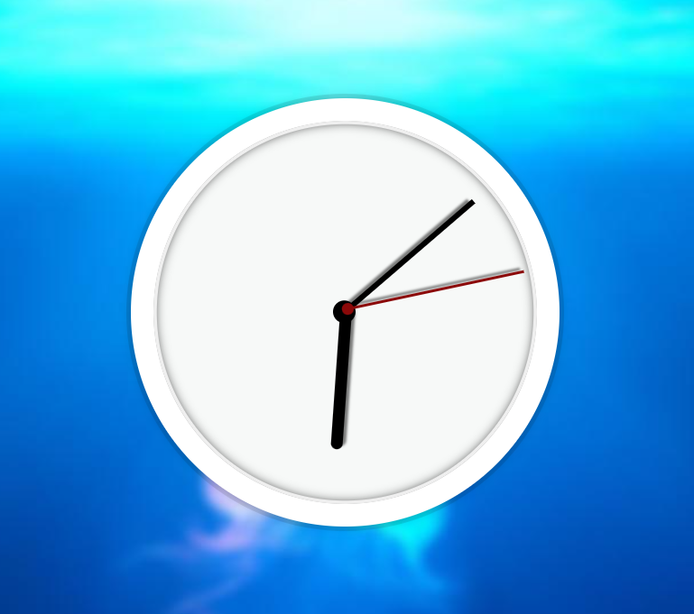

# JavaScript30 - JS and CSS Clock

This is a JavaSCript and CSS Clock created as part of JavaScript30 challenge. (https://javascript30.com/)

### Screenshot

### Links

- Solution URL: https://github.com/Rocky-MPN/Frontend/tree/main/JavaScript30/JS-and-CSS-Clock
- Live Site URL: https://rocky-mpn.github.io/JS-and-CSS-Clock/

## My process

### Built with

- HTML
- CSS
- JavaScript

## Author
- Twitter - [@Rocky_MPN](https://www.twitter.com/Rocky_mpn)
