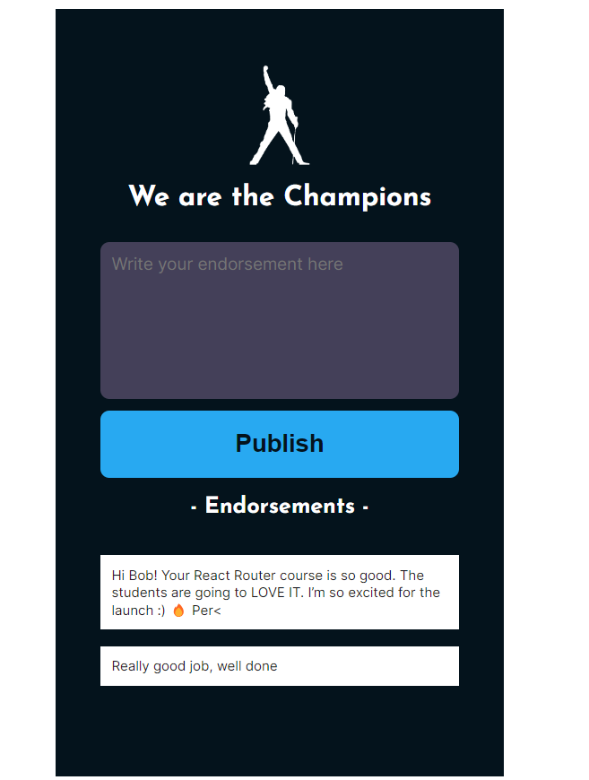

# Scrimba - Endorsement Cart App

This is a solution to the Frontend Developer Career Path module 3 - Shopping Cart App - on Scrimba [Frontend Career Path](https://scrimba.com/learn/frontend)

The aim of this project was to create a basic shopping cart app using JavaScript, CSS and HTML.
## Requirements
#### - Link app with Firebase database
#### - Update in realtime
#### - Functionality add new endorsements to the list
#### - Functionality to remove items from the list when double clicked on them

## Links

- Solution URL: [https://github.com/Rocky-MPN/Frontend/tree/main/Scrimba/Endorsement-App](https://github.com/Rocky-MPN/Frontend/tree/main/Scrimba/Endorsement-App)
- Live Site URL: [https://rocky-mpn.github.io/Endorsement-App/](https://rocky-mpn.github.io/Endorsement-App/)

##Screenshot

