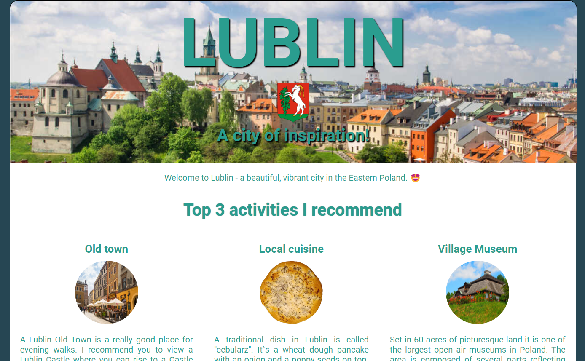

# Scrimba - Hometown Project

This is a solution to the Frontend Developer Career Path module 2 - Solo Project - on Scrimba [Frontend Career Path](https://scrimba.com/learn/frontend)

I've created a simple responsive design for my home town using CSS and HTML.

## Links

- Solution URL: [https://github.com/Rocky-MPN/Frontend/tree/main/Scrimba/Hometown-Project](https://github.com/Rocky-MPN/Frontend/tree/main/Scrimba/Hometown-Project)
- Live Site URL: [https://rocky-mpn.github.io/Hometown-Project/](https://rocky-mpn.github.io/Hometown-Project/)

##Screenshot

