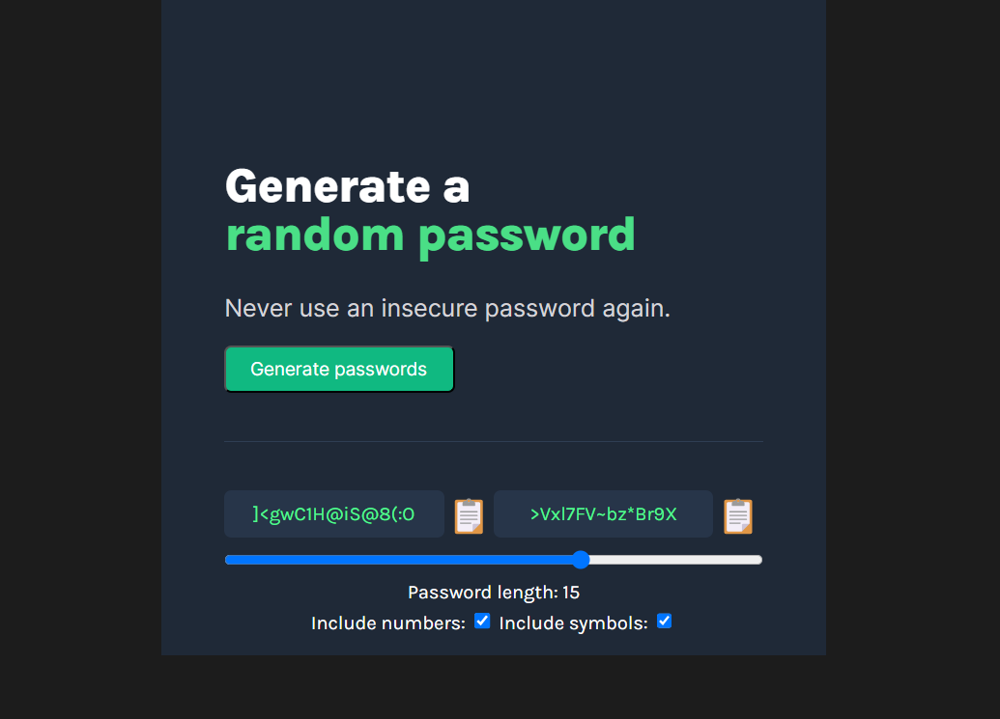

# Scrimba - Password Generator

This is a solution to the Frontend Developer Career Path module 3 - Solo Project - on Scrimba [Frontend Career Path](https://scrimba.com/learn/frontend)

## Requirements
- Build from "scratch
- Generate two random passwords when the user clicks the button
- Each password should be 15 characters long
- Use figma file to match style

## Stretch goals (If you want to go above & beyond)
- Ability to set password length
- Add a "copy-on-link"
- Toggle "symbols" and "numbers" on/off

## Links

- Solution URL: [https://github.com/Rocky-MPN/Frontend/tree/main/Scrimba/Hometown-Project](https://github.com/Rocky-MPN/Frontend/tree/main/Scrimba/Password-Generator)
- Live Site URL: [https://rocky-mpn.github.io/Hometown-Project/](https://rocky-mpn.github.io/Password-Generator/)

##Screenshot

